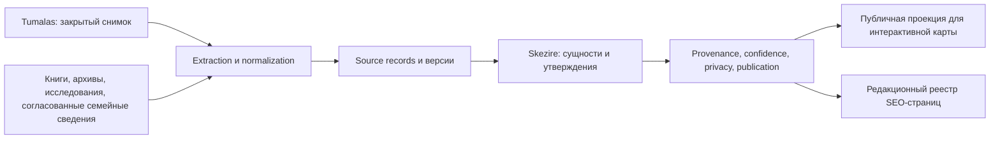

# Целевая база знаний и правила выдачи Skezire

Статус: проект решения от 2026-09-05. Новые таблицы, миграции, права и публикации **не применены**. Реальные числа и алгоритм отбора — в [README](README.md), [запросах](queries.json) и [срезе Neon](neon-profile.json).

## Архитектура: сохранить источник, отдельно строить знания

Достаточно PostgreSQL и существующей выдачи детей/поиска. Отдельный graph database, vector database, LLM-классификатор и второй frontend не нужны на этом этапе. Граф знаний — сущности плюс типизированные утверждения; интерактивное дерево — одна из его проекций. Нельзя превращать каждое `parent` из Tumalas в биологическое отцовство: это может быть группировка, эпоним, предание, ветвь или связь неизвестного вида.

Существующие `genealogy_nodes` оставить неизменяемым входным слоем этого исследования. Новые канонические идентификаторы не должны зависеть от `parent`: нынешний `source:id:parent` меняется при исправлении родителя. Использовать внутренний UUID сущности; source ID и версии сопоставлять отдельно. Совпадение имён не означает тождество, объединение — явное обратимое редакционное решение.

## Минимальная модель provenance

Ниже логические таблицы и обязательные поля, не production DDL. Отдельные таблицы нужны из-за разных кардинальностей: у одного факта несколько источников, у источника много фактов, у пары сущностей несколько конфликтующих связей.

| Объект | Поля и назначение |
|---|---|
| `sources` | `id`, `name`, `publisher/author`, `source_type` (API/book/archive/oral/user), `canonical_url`, `edition`, `published_at`, `rights_status` (`unknown/licensed/public_domain/legal_exception/restricted`), `license_url`, закрытая ссылка на договор/основание, `allowed_uses`, `rights_reviewed_by/at`, `source_family_id` — общий первоисточник для перепечаток |
| `source_snapshots` | `id`, `source_id`, `retrieved_at`, отдельно `claimed_source_date`, `sha256`, `extractor_version`, `schema_version`, `access_context`, `secure_object_ref`, `coverage_notes`, `retention_review_at`. Старый mtime — заявленная дата локального файла, не доказанное время получения API |
| `source_records` | `id`, `snapshot_id`, `external_id`, исходный parent ID, `source_url`, `source_locator`, `payload_hash`, `raw_ref`, `language`, `source_locked_raw`, `normalization_version`, `source_deleted_or_missing`. Сырые данные и contributor IDs закрыты; не добавлять `userId` только ради полноты |
| `entities` | стабильный `id`, `entity_type` (`zhuz/clan/subclan/branch/person/container/unknown`), `canonical_label`, локализованные названия через утверждения, `resolution_status`, `merged_into` и журнал обратимости. Метка A/B/C/D — результат классификации версии, не поле «истина навсегда» |
| `assertions` | `id`, `subject_entity_id`, `predicate`, **либо** `object_entity_id` **либо** typed `value`, `valid_from/to` + точность даты, `tradition_or_context`, `status` (`proposed/accepted/disputed/rejected/superseded`), `supersedes_id`. Примеры: `label`, `entity_type`, `member_of`, `subgroup_of`, `parent_of`, `traditional_descent_from`, `source_parent_unspecified`, `born`, `died`. Смерть/рождение вводятся только из нового доказательства, их сейчас нет в Neon |
| `assertion_evidence` | `assertion_id`, `source_record_id` или библиографический locator, `source_url`, `page/section`, краткий paraphrase/допустимая цитата, `stance` (`supports/refutes/mentions`), `independence_group`, `reviewer`, `checked_at`, `identity_match_basis`. Для **каждой связи** собственная evidence-запись; источник имени не подтверждает родителя |
| `assessments` | `target_type/id` (сущность/факт/связь), `classification`, `classification_confidence`, `identity_confidence`, `evidence_confidence`, `verification_status`, `living_person_risk` (`unknown/possible/confirmed_living/confirmed_deceased/not_person`), `risk_basis`, `method_version`, `assessed_by/at`. Числовая вероятность nullable до калибровки; `high/medium/low` — рубрика, не проценты точности |
| `publication_decisions` | цель решения, канал (`map/search/export/seo`), `status` (`private/review_required/approved/withheld/withdrawn`), `legal_basis_ref`, отдельно `rights_basis_ref`, `consent_ref` если применимо, `scope`, `decided_by/at`, `policy_version`, `expires_at`, `reason`, `superseded_by`. Согласие на семейное хранение не переносится автоматически на открытый поиск/SEO |
| `seo_pages` | `entity_id/topic_id`, `locale`, `slug`, `canonical_url`, `editorial_status`, `indexing_status`, `approved_assertion_ids`, `content_reviewed_at`, `content_modified_at`, `search_intent`, `source_quality_review`, `redirect_to`. У сущности может не быть страницы; одна страница может объяснять несколько сущностей |

Библиографические факты разрешено хранить компактно: для книги одна source-запись, затем locator страницы на каждом утверждении. Не копировать целиком книгу или чужое описание ради ссылки. URL Tumalas для детей имеет вид `https://tumalas.kz/api/kazakh/mobi?id={parent_id}`: это адрес ответа родителя, не автоматически персональная страница ребёнка. Для текущего импортированного узла хранить `source_url_status=reconstructed_unverified`, пока ответ/архив не сопоставлен; не выдавать восстановленный URL за сохранённый оригинал.

**E — независимая подтверждённость конкретного утверждения.** `entity_type` может быть подтверждён, а `parent_of` — нет. Два зеркала одной книги дают одну evidence family. Наличие факта в `TRIBES_DB` само по себе не даёт E: история происхождения репозиторного текста не установлена. В этом исследовании внешнее подтверждение ограничено типом 11 верхних родов и 7 подродов, а также 7 связями традиционного деления; не всей их родословной.

## Publication policy

Все импортированные записи получают исходное решение `private`; классификатор создаёт очередь review, не вызывает публикацию и не меняет `is_public`. `locked`, `source_locked`, число потомков, порядковый ID, `taipa` и глубина никогда не дают права публикации.

| Класс/состояние | Карта и поиск | Что требуется |
|---|---|---|
| A: жуз/род/подрод/ветвь | Кандидат после проверки, не auto-public | Однозначная сущность, неперсональный смысл, допустимое использование источника, редакционное решение для фактов и связей |
| B: подтверждённая историческая персона | Возможна отдельная карточка | Identity match, источник периода/смерти, права на текст/иллюстрации, проверка связей с живыми; предание явно обозначать |
| B-review: только титул в имени | Private / ручная проверка | Титул не доказывает историчность и смерть |
| C: потенциально живой человек | Private; приватный семейный сценарий отдельно от общей карты | Подтверждённое основание для обработки, scope согласия, отдельное решение для публичного поиска и связей с другими людьми |
| D: неопределённая запись | Private / ручная проверка | Установить тип и оценить риск; неизвестное не означает безличное |
| E для одного факта | Не меняет приватность автоматически | Объём подтверждения и прав отдельно; E возможен и у живого человека |
| Root/container | Отдельное решение для навигации | Подпись контейнера не превращается в историческую персону или доказанного предка |

Публичная проекция включает только разрешённые **узлы, поля и рёбра** с допустимым полным путём. Если промежуточный предок закрыт, не раскрывать его имя, ID, наличие потомков или количество результатов. Не переподвешивать потомка к открытому деду так, будто доказана прямая связь: либо закрыть путь, либо добавить отдельную подтверждённую `member_of` и показать иной смысл связи. Разрешённость корня/рода не распространяется на потомков.

Общий предикат использовать в initial tree, children, search, breadcrumbs, `hasChildren`, export, server-rendered HTML/JSON и любых кэшах. Reader публичного приложения должен видеть только разрешённую проекцию; доступ исследователя к raw-слою — другой credential и контур. Preview с private-данными требует авторизации на сервере и контроля выдачи, `noindex` недостаточен. Текущий public-only защищённый preview сохраняется в рамках отдельной задачи выпуска.

Изменение значимого факта/связи, новый спор, отзыв согласия или истечение решения инвалидирует соответствующую выдачу и кэш; очередь повторного review должна сохранять предыдущую версию и причину. Проектировать блокирование/исправление/удаление по обращениям вместе с юристом; **в этом этапе существующая Neon не удалялась и не изменялась**. Отказ в выдаче не должен подтверждать существование закрытой записи.

## Отдельная SEO policy

Индексируемая страница появляется только через редакционный реестр `seo_pages`, никогда через `SELECT genealogy_nodes` для генерации sitemap или `generateStaticParams`. Массовое создание малоценных страниц ради поиска подпадает под риски scaled content/doorway abuse; Google оценивает назначение и полезность, а не просто количество URL. [Google spam policies](https://developers.google.com/search/docs/essentials/spam-policies).

Сначала улучшать существующие страницы жузов/родов, общую карту и энциклопедию. Проверить факты kk/ru, ссылки на источники и связь с картой. Историческая персона/ветвь получает новую страницу только при самостоятельной теме, полезном проверенном содержании, допустимой публикации и отсутствии страницы с тем же намерением. Не устанавливать искусственное минимальное число слов; имя + предок + список детей сами по себе недостаточны для отдельного SEO-материала.

Правила допуска: (1) все опубликованные факты прошли policy; (2) понятен самостоятельный вопрос читателя; (3) есть ответ, контекст, различение версии/предания/спора и источники; (4) редактор проверил оба языка, где они существуют; (5) прямой 200, подходящий canonical, доступные HTML-ссылки; (6) `lastmod` отражает изменение содержания. Отсутствующий перевод не подменять автоматической копией. Для реально существующих локализованных страниц — self-canonical и взаимный hreflang.

Карту можно расширять разрешёнными узлами без создания страниц на каждый узел. Параметр выделения узла на той же карте сохраняет canonical общей карты, если содержание по существу дублируется; это не директива privacy и не гарантия выбранного поисковиком canonical. Для отдельных открытых служебных/detail/search маршрутов без самостоятельной ценности — `noindex`, исключение из sitemap, без бесконечных crawlable комбинаций фильтров. Не использовать canonical общей карты как замену `noindex` для любого отличающегося документа. [Google canonical](https://developers.google.com/search/docs/crawling-indexing/consolidate-duplicate-urls).

Закрытые узлы защищать серверной авторизацией/фильтрацией. `robots.txt` и `noindex` не закрывают доступ; робот должен иметь возможность прочитать `noindex` на доступной служебной странице. [Google noindex](https://developers.google.com/search/docs/crawling-indexing/block-indexing).

Следующая SEO-очередь — по полезности материалов и фактическим GSC-данным после выпуска. Это исследование не измеряло поисковый спрос и не обещает трафик. Новый импорт не является поводом отправлять IndexNow или менять sitemap. Не считать 11 corroborated родов 11 новыми страницами: многие темы уже существуют.

## Следующий технический этап и приёмка

1. В изолированной dev-базе создать минимальный provenance pilot для списка кандидатов из отчёта. Сохранить readonly lineage до исходного `node_key`; не переносить весь снимок на новый сервис. Проект локации хранения raw/персонального слоя согласовать отдельно, технически использовать обезличенные тестовые записи.
2. Занести подтверждённые в исследовании факты о 11 родах и 7 подродах, с отдельным evidence для 7 связей традиционного деления; проверить их редакционное и правовое решение для пилота. Root рассматривать как контейнер; отдельные `member_of(Ұлы жүз)` — новый слой фактов из книги, не исправление source-parent. Отдельно разобрать `Шақшам` и несогласованность репозиторного Жаныс.
3. Создать закрытую очередь A/B-review/C-signal/D с версией правила, locator доказательства, reviewer и решением. Никакого auto-publish. Для B/C/D сначала стратифицированная ручная разметка: титулы, патронимы, листья/не-листья, taipa, уровни глубины; двойная разметка спорных случаев. Сохранить sampling seed и вероятности включения; числовой confidence получать только после gold set и оценки precision/recall, отдельно по стратам. Размер следующего пилота — выбранный рабочий объём, не статистический вывод этой записки.
4. Переиспользовать проверенный адаптер из worktree `151b`: публичная проекция, полный путь, запрет private override. Подготовленную source-lock migration не дублировать; её применение остаётся отдельным решением выпуска. Runtime текущего checkout не принимать за актуальную release-версию.
5. Приёмка dev: source hash и version воспроизводимы; два источника одного факта сохраняются; несовпадающие факты не стираются; одноимённые люди не сливаются; `source_parent_unspecified` не превращается в `parent_of`; E типа не повышает E связи; private промежуточный узел не просачивается ни одним способом; отзыв решения инвалидирует выдачу. Обязательное независимое ревью privacy/архитектуры до интеграции.
6. После юридического решения и редакционного review подготовить точный dry-run manifest: entity IDs, facts, edges, source rights, решения, полный путь, число новых публикаций. Только отдельное разрешение позволяет выполнить DDL/публикацию. Новый этап не включает массовое открытие данных.
